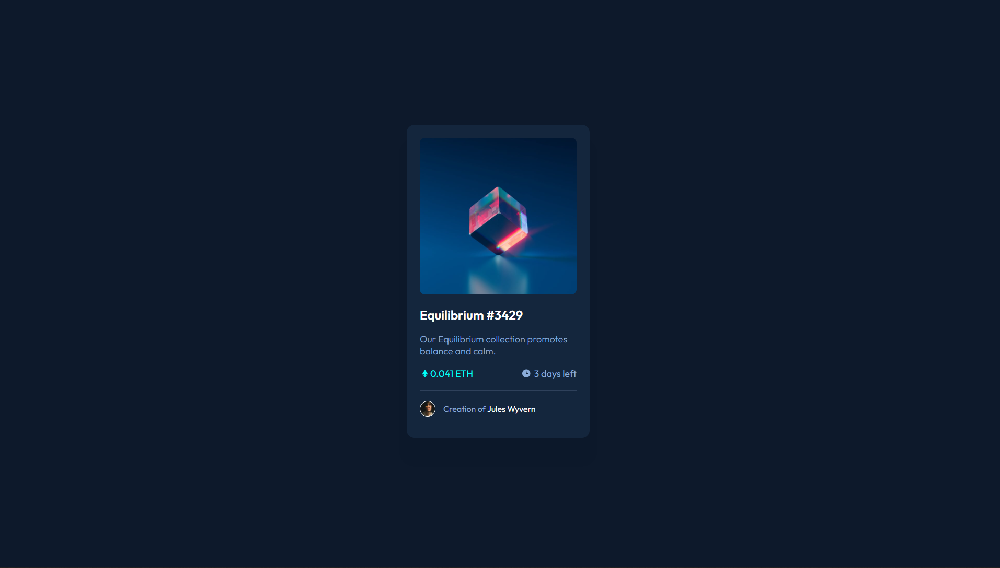

# Frontend Mentor - NFT preview card component solution

This is a solution to the [NFT preview card component challenge on Frontend Mentor](https://www.frontendmentor.io/challenges/nft-preview-card-component-SbdUL_w0U).

## Table of contents

- [Screenshot](#screenshot)
- My process:
  - [Built with](#built-with)
- [Author](#author)

### Screenshot

### Built with

- Semantic HTML5 markup
- CSS custom properties
- Flexbox
- Mobile-first workflow

## Author

- Website - [Seth Addo](https://seths10.github.io/main-portfolio/)
- Frontend Mentor - [@seths10](https://www.frontendmentor.io/profile/seths10)
- Twitter - [@set_addo](https://www.twitter.com/set_addo)
